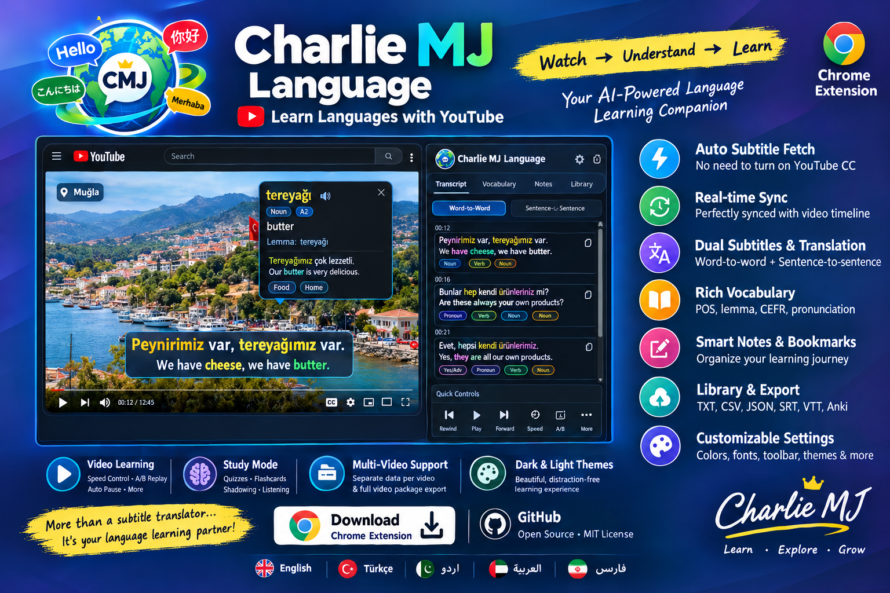

# Charlie MJ Language — v4.3.3

**A lightweight, local-first Chrome extension for learning languages through YouTube.**



Charlie MJ Language brings subtitles, transcript study, vocabulary, sentence saving, translation, dictionary lookups, and learning-library tools into the YouTube viewing experience.

## Download

<p align="center">
  <a href="/downloads/charlie-mj-language-v4.3.3-final.zip">
    
  </a>
</p>

- **Version:** `4.3.3`
- **Platform:** Chrome Extension — Manifest V3
- **Minimum Chrome version:** 114
- **License:** MIT
- **Project:** [GitHub repository](https://github.com/awsrmmustansarjavaid/charlie-mj-language)

> **Learning flow:** Watch → Understand → Capture → Organize → Review → Continue

## What's new in v4.3.3

### Configurable success notification position

The **Settings → UI Components → Success notifications** section lets you choose where save-success and status notifications appear:

- **Center Below Subtitles** — default
- **Bottom Right**
- **Bottom Left**

This setting changes notification placement without replacing the subtitle, transcript, or library workflows.

### Modular transcript Service Engine

- Added a dedicated **Service Engine** section in Settings.
- Added `transcript-service.config.json` as a separate configuration contract for transcript services.
- Kept the existing fast YouTube transcript-fetching engine as the default: `legacy-youtube`.
- Added configurable caption-track preferences: original/manual first, manual/original first, or auto-generated first.
- Supports discovery of caption languages when YouTube exposes them for a video.
- Preserves backward compatibility; the existing fetch implementation remains authoritative while future providers can be added through adapters.

**Important:** The configuration prepares the architecture for additional providers; it does not mean that every future transcript provider is already implemented. Available tracks and languages depend on YouTube and the individual video.

### UI and learning workflow

- Adjustable YouTube learning toolbar, including position, size, scale, button arrangement, and hover-reveal behavior.
- Resizable, draggable transcript window with positioning, pinning, and window controls.
- Adjustable subtitle appearance, including size, color, and text formatting.
- Word and sentence learning actions linked to YouTube video context and timestamps where available.
- Translation and dictionary information, including provider/source labels when returned by the service.
- Vocabulary and sentence saving, notes, bookmarks, and learning-library workflows.
- Local-first settings and learning data using Chrome storage.

## Core features

### YouTube subtitles and transcript

- Fetches YouTube caption tracks independently of the native CC display when available.
- Displays original and translated subtitles.
- Provides a timestamped transcript and subtitle/timeline synchronization.
- Supports available manual/original and auto-generated caption tracks.
- Supports available caption-language discovery where YouTube exposes track metadata.
- Includes transcript and learning-data export tools.

### Word and sentence learning

- Interactive word lookup and translation.
- Dictionary and translation source details when provided by the selected service.
- Part-of-speech highlighting and visual formatting.
- Vocabulary capture and sentence saving.
- Video-linked learning records and timestamp context where available.
- Sentence replay, looping, A/B replay, and playback-speed learning controls where available in the interface.

### Learning library and productivity

- Vocabulary, sentence learning, bookmarks, notes, Watch Later, and related saved learning items.
- Search and filtering tools for supported library views.
- Import/export tools for supported formats, including common transcript and learning-data formats.
- Local-first storage: data remains in Chrome local storage unless you explicitly export or download it.
- Focus Mode and toolbar controls to support a less distracting learning workflow.

### Customization

- Success notification position settings.
- Toolbar visibility, position, size, and reveal settings.
- Transcript window position, dimensions, and controls.
- Subtitle display and learning-interface appearance settings.
- Transcript Service Engine configuration kept separate from the UI settings.

*Feature availability can depend on the current YouTube page, available caption tracks, browser permissions, and the external service response.*

## Installation

1. Download or clone the repository and extract it if you downloaded a ZIP.
2. Open Chrome and visit `chrome://extensions`.
3. Enable **Developer mode**.
4. Click **Load unpacked**.
5. Select the extracted extension folder containing `manifest.json`.
6. Open or refresh a YouTube video.

If YouTube was already open when you installed or reloaded the extension, refresh that tab once.

## Settings

Open the extension's Settings page to configure the interface and learning behavior.

- **UI Components:** Set success notification position and adjust toolbar/transcript UI controls.
- **Service Engine:** Choose the available transcript engine, set caption-track preference, and enable caption-language discovery when exposed by YouTube.
- **Subtitle & timeline engine:** Configure subtitle fetching and synchronization options.
- **Appearance:** Choose the learning-interface theme where supported.

The current default transcript engine is `legacy-youtube`. Keep this setting unless you are testing a provider that has been explicitly implemented and validated.

## Transcript service configuration

The root-level `transcript-service.config.json` defines the configuration contract for transcript engines. It currently identifies `legacy-youtube` as the default and records supported capabilities and track-preference options.

The current implementation remains in `src/content/youtube.js` (`fetchYouTubeCaptionBundle`). Future providers should be added as separate adapters and integrated without replacing the stable default path until compatibility and regression tests pass.

Do not treat a listed capability as a guarantee that YouTube provides a track for every video. Caption availability is controlled by YouTube and the video owner/source.

## Project structure

```text
charlie-mj-language/
├── assets/                         # Extension images and assets
├── docs/                            # Project and implementation documentation
├── icons/                           # Extension icons
├── src/
│   ├── background/                  # Background service worker
│   ├── content/                     # YouTube integration and page scripts
│   ├── dashboard/                   # Learning library/dashboard
│   ├── lib/                         # Shared utilities
│   ├── options/                     # Settings interface and logic
│   └── popup/                       # Extension popup
├── transcript-service.config.json   # Modular transcript service configuration
├── manifest.json                    # Chrome Extension Manifest V3
├── LICENSE
└── README.md
```

## Privacy and storage

Charlie MJ Language uses Chrome extension storage for local settings and learning records. Some features contact external services, such as translation or dictionary providers, to perform the requested lookup. Review the relevant provider's terms and privacy policy when using those services. Exported files are saved through the browser's download flow.

## Development and testing

- JavaScript, HTML, and CSS for a Chrome Manifest V3 extension.
- Uses Chrome extension APIs for storage, downloads, context menus, scripting, and related browser integration.
- YouTube integration depends on page/player behavior that can change over time.
- Test on real YouTube videos with different caption-track configurations before releasing changes.

### Recommended regression checks

After changing UI settings or transcript services, verify:

1. The existing default transcript engine still fetches available captions.
2. Original/manual and auto-generated tracks are handled according to the selected preference when available.
3. Subtitle display and timeline synchronization continue to work.
4. Vocabulary and sentence saving still work and saved items appear in the library.
5. Library search, editing, import, and export remain functional.
6. Success notifications appear in the selected position.
7. Toolbar and transcript window controls remain usable at different sizes and positions.

## Compatibility and roadmap

The modular service configuration is designed to make future transcript providers possible. New providers should be introduced incrementally behind a separate adapter, with the current fast YouTube engine retained as the fallback/default until a replacement has passed regression testing.

Potential future improvements include additional caption-provider adapters and expanded provider diagnostics. These are roadmap ideas, not claims that those services are already available in this release.

## License

This project is distributed under the MIT License. See [`LICENSE`](LICENSE) for details.
